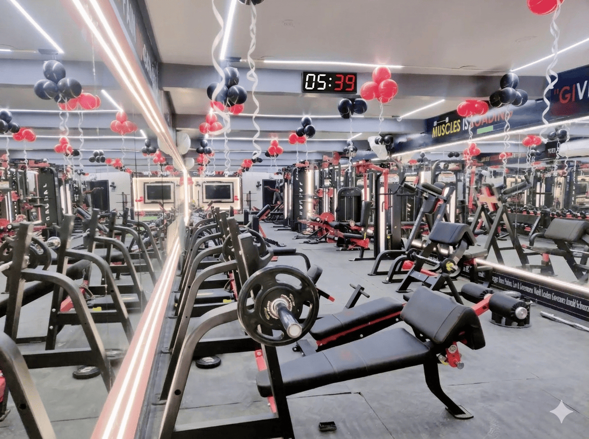

# Basti Gym & Fitness Club — Website

A fully static, multi-page gym website built with HTML, CSS, and vanilla JavaScript.
Designed for GitHub Pages deployment — no build tools or backend required.

## 📁 Project Structure

```
/
├── index.html          ← Home page
├── about.html          ← About page
├── services.html       ← Services & Pricing page
├── contact.html        ← Contact page + Map + Form
├── css/
│   └── styles.css      ← All styles (dark theme, responsive)
├── js/
│   └── script.js       ← Navbar, animations, form logic
└── assets/
    └── images/         ← ⬅ Add real gym photos here
```

## 🖼️ Adding Real Photos

Replace placeholder boxes with actual `` tags in each HTML file.
Search for `[ ... Photo ]` comments to find exact locations.

| Placeholder Comment | Suggested Image | Dimensions |
|---|---|---|
| `[ Hero Gym Photo ]` | Training floor / athlete | 1200×900 px |
| `[ Gym Interior Photo ]` | Wide gym shot | 800×1000 px |
| `[ Founder / Gym Story Photo ]` | Founder portrait | 800×1000 px |
| `[ Trainer Photo ]` | Trainer headshot | 600×800 px |
| `[ Weight Training Floor ]` | Weight area | 800×600 px |
| `[ Cardio Zone ]` | Cardio machines | 800×600 px |
| `[ CrossFit Area ]` | CrossFit rig | 800×600 px |
| `[ Women's Section ]` | Women's floor | 800×600 px |

Example swap:
```html
<!-- Before (placeholder) -->
<div class="img-placeholder-box">...</div>

<!-- After (real image) -->

```

## 🚀 Deploy to GitHub Pages

1. Push this folder to a GitHub repository
2. Go to **Settings → Pages**
3. Set Source: **Deploy from branch** → `main` → `/ (root)`
4. Your site will be live at `https://yourusername.github.io/repository-name/`

## 🎨 Customisation

- **Colors** — edit CSS variables at the top of `css/styles.css`
- **Phone number** — search & replace `9807320940` across all HTML files
- **Google Map** — replace the `iframe src` in `contact.html` with your exact embed URL
- **Social links** — update `href="#"` in each footer and contact page

## 📞 Contact Info

- **Phone:** +91 98073 20940
- **Location:** Gandhi Nagar, Near District Hospital, Basti, Uttar Pradesh
- **Hours:** 5:00 AM – 10:00 PM, 7 days a week
